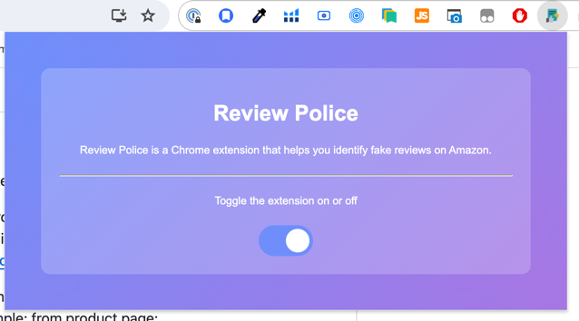
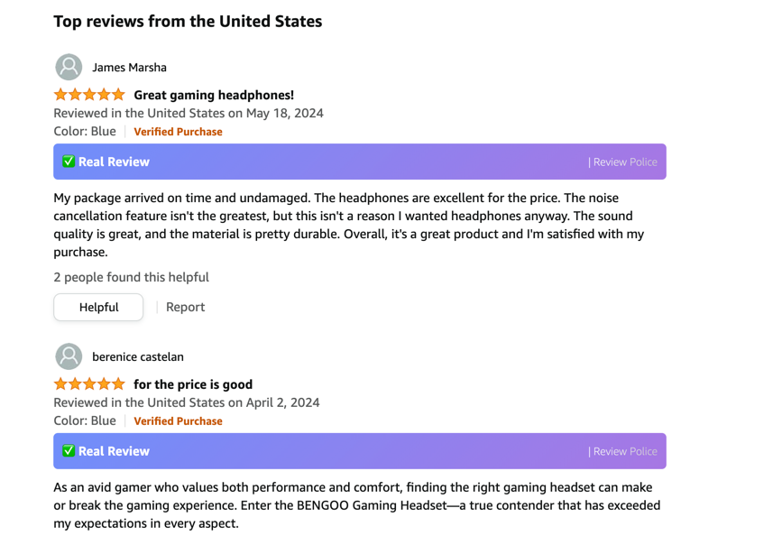
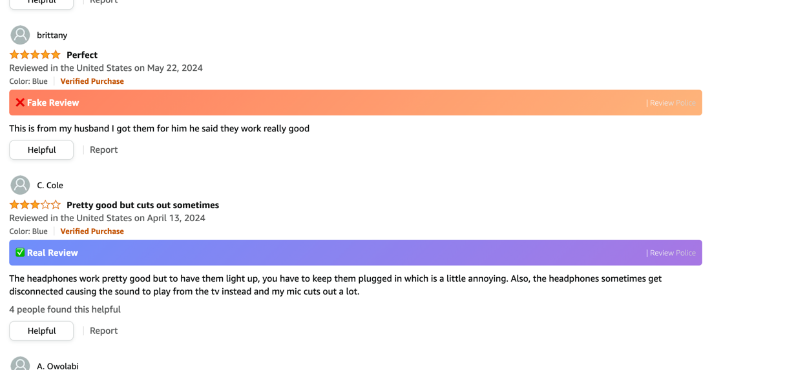

# AI_Final_Project

### Topic Selected - NLP

This project likely is fitting "Max" requirement - which covers usable end-2end system with an ML Model (that was not covered in class)

### Model training:
https://colab.research.google.com/drive/1-swZ2MeHqbjly16hT0CsD8x_sxHWYBPS?usp=sharing

### Backend
Built with flask. 
https://github.com/gcilinskas/ai_fake_review_detector

Endpoint Usage example:
```
curl --location 'https://api.reviewpolice.com/predict' \
--header 'Content-Type: application/json' \
--data '{
    "text": "Great product!"
}'
```

### Frontend
This is Chrome extension.

https://github.com/gcilinskas/extension_fake_review_detector

Installation:
Clone repo: git@github.com:gcilinskas/extension_fake_review_detector.git

Load folder as unpacked extension in Chrome:
To load it, visit chrome://extensions/ (and enable developer mode if not enabled).
Then click "Load unpacked" and select the "extension_fake_review_detector" folder.
https://medium.com/@aabroo.jalil/how-to-test-a-chrome-extension-locally-step-by-step-guide-852e4622d4c7

Usage:
Whether review is fake or not, it will be displayed in chrome on amazon page, if extension is enabled.

Make sure extension is enabled in settings:


To test it once extension is loaded these pages can be used as example:
from product page: https://www.amazon.com/dp/B01H6GUCCQ

or review page: https://www.amazon.com/product-reviews/B01H6GUCCQ



# Bonus
## IMDB Review Sentiment Analysis
I also wanted to cover Deep neural networks part with NLP

So I took IMDB review sentiment analysis problem, to try to improve model with deep learning (with comparison with ML model as well)
I also tried to play with transformer architecture, but included it as "bonus" because results are not perfect, and missing some time to properly implement it.

I took this lesson as a starting point: https://colab.research.google.com/drive/1a7BAGT8zGmtq9YJ7Mfg64jl1fp2CvbIP?usp=sharing

### Model training:
https://colab.research.google.com/drive/1pk2OrfHtQbF8-OW-luAxXfqV5fCm-L2j?usp=sharing